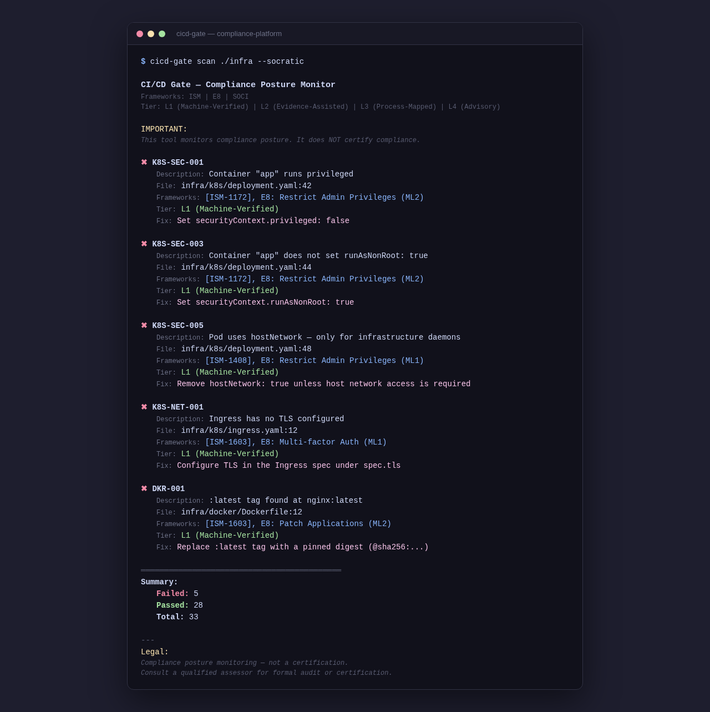

# I Built an Open-Source Compliance Gate for Kubernetes — It Checks Against Australian ISM and Essential Eight Standards

**TL;DR:** `cicd-gate` is a CLI and GitHub Action that checks your Kubernetes manifests, Docker configs, and IaC against **Australian ISM and Essential Eight** compliance policies. Every violation has framework IDs, tier labels (L1-L4), and remediation hints. [GitHub](https://github.com/monch1962/compliance-platform) • `go install github.com/monch1962/compliance-platform/packages/cicd-gate@latest` • GitHub Action: `monch1962/compliance-platform@v0.2.0`



---

Every Australian organisation that deals with the SOCI Act, the ACSC Information Security Manual (ISM), or the Essential Eight knows the drill: download a PDF, cross-reference controls against your infrastructure, build a spreadsheet, and hope you catch everything before the auditor arrives.

I got tired of doing this manually. So I built a compliance gate that runs in your CI pipeline — and it speaks Australian standards.

## What It Does

`cicd-gate scan . --socratic` runs 33 policy checks against your Kubernetes and Docker configurations. Each violation shows you:

```
✖ K8S-SEC-001: Container "app" runs privileged
   Description: Container nginx runs privileged
   File:        infra/k8s/deployment.yaml:42
   Frameworks:  [ISM-1172], E8: Restrict Admin Privileges (ML2)
   Tier:        L1 (Machine-Verified)
   Fix:         Set securityContext.privileged: false in the container spec
```

No other open-source tool maps Rego policies to Australian compliance frameworks. This one does.

## What It Checks (Against Which Frameworks)

| Area | Rule Count | ISM Control | Essential Eight |
|---|---|---|---|
| Privilege escalation | 4 | ISM-1172 | Restrict Admin Privileges (ML2) |
| Host namespace access | 3 | ISM-1408 | — |
| Resource management | 2 | ISM-0290 | — |
| Probes & resilience | 1 | ISM-1403 | — |
| Image security | 2 | ISM-1603 | Patch Applications (ML2) |
| Service accounts & IAM | 9 | ISM-1172 | Restrict Admin Privileges (ML2) |
| Network security | 4 | ISM-1603, ISM-1408 | Multi-factor Auth (ML1) |
| Storage & secrets | 5 | ISM-1172 | Restrict Admin Privileges (ML2) |
| Docker image tags | 1 | ISM-1603 | Patch Applications (ML2) |
| Hardcoded credentials | 2 | ISM-1172 | — |

**33 Rego rules, verified by conftest, tested against 4 QA matrix combinations. CI pipeline green.**

## Why Australian Standards?

There are plenty of open-source compliance tools — but they all speak NIST, CIS, or SOC 2. If you're an Australian organisation dealing with the ISM or Essential Eight, you're on your own.

The ISM has 1,400+ controls. Essential Eight has ~40 testable sub-controls. Neither has an open-source toolchain that checks your IaC against them in CI. Until now.

## The Verification Tier Model

Not every control can be automated. I've categorised every rule into one of four tiers:

| Tier | Name | What It Means |
|---|---|---|
| **L1** | Machine-Verified | Automated pass/fail in CI. No human needed. |
| **L2** | Evidence-Assisted | Automated checks + evidence collection. Human reviews. |
| **L3** | Process-Mapped | Policy and procedure probes. Template-based. |
| **L4** | Advisory | Principles-based guidance and attestation. |

**Phase 1 ships L1 only** — the controls that can be fully automated in CI. L2-L4 are in development for ISM, SOCI, CPS 234 (financial services), TSSR (telco), PSPF (government), and APPs (privacy).

## Quick Start

Add to `.github/workflows/compliance.yml`:

```yaml
on: [pull_request]
jobs:
  compliance:
    runs-on: ubuntu-latest
    steps:
      - uses: actions/checkout@v4
      - uses: monch1962/compliance-platform@v0.2.0
```

Or from the CLI:

```bash
cicd-gate scan . --socratic
```

Requires [conftest](https://github.com/open-policy-agent/conftest) to be installed.

## What's Next

I'm building out a 7-framework roadmap over the next 24 weeks:

| Phase | Frameworks | When |
|---|---|---|
| L1 Machine-Verified | E8 + ISM TOP 35 | Now |
| Full ISM + SOCI | 1,400+ ISM controls, SOCI technical | Weeks 7-12 |
| CPS 234 + TSSR | Financial services + telco | Weeks 13-18 |
| PSPF + APPs | Government + Privacy Act | Weeks 19-24 |

If you're an Australian telco, financial services organisation, or Commonwealth entity, I'd love your input on which controls matter most.

**[Star the repo](https://github.com/monch1962/compliance-platform)** • **Contribute a Rego policy** • **Open an issue**

---

*Disclaimer: This tool monitors compliance posture. It does NOT certify compliance. Apache 2.0 license.*
